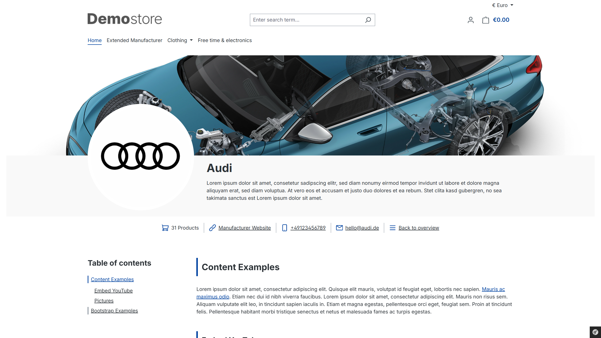
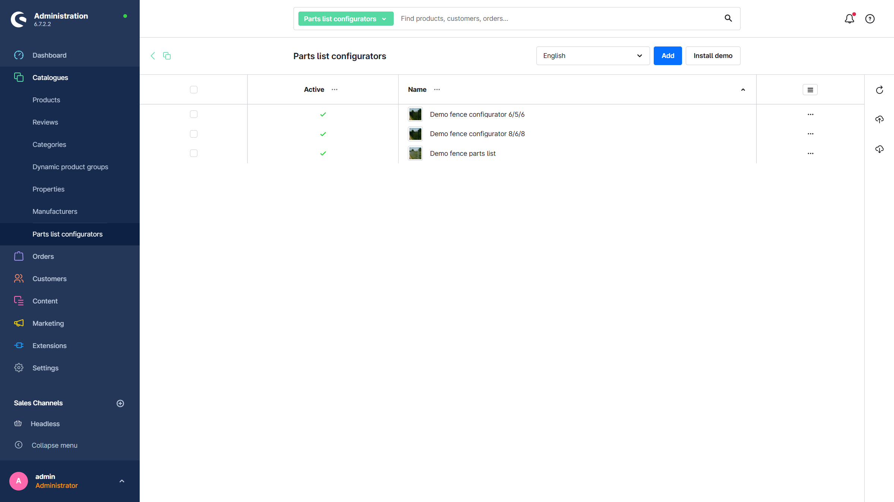
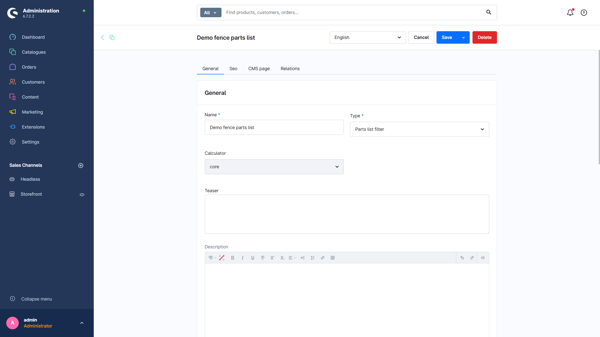
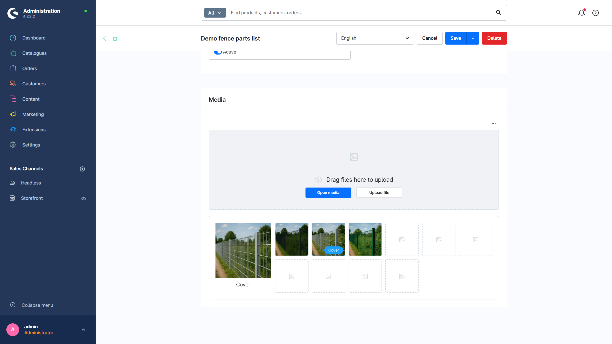
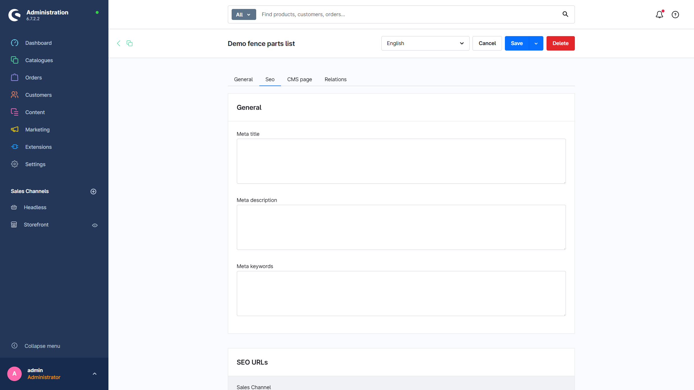
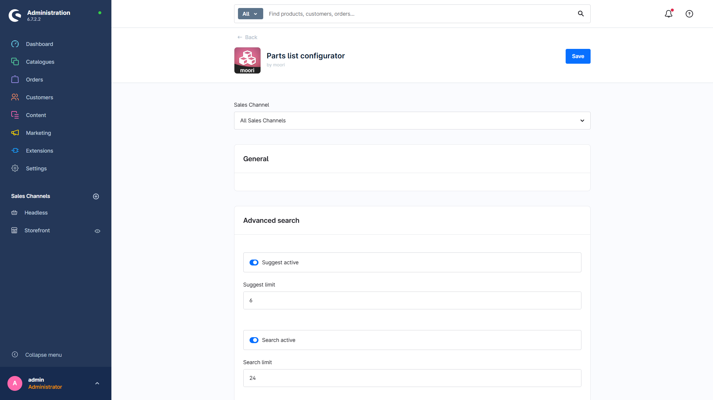
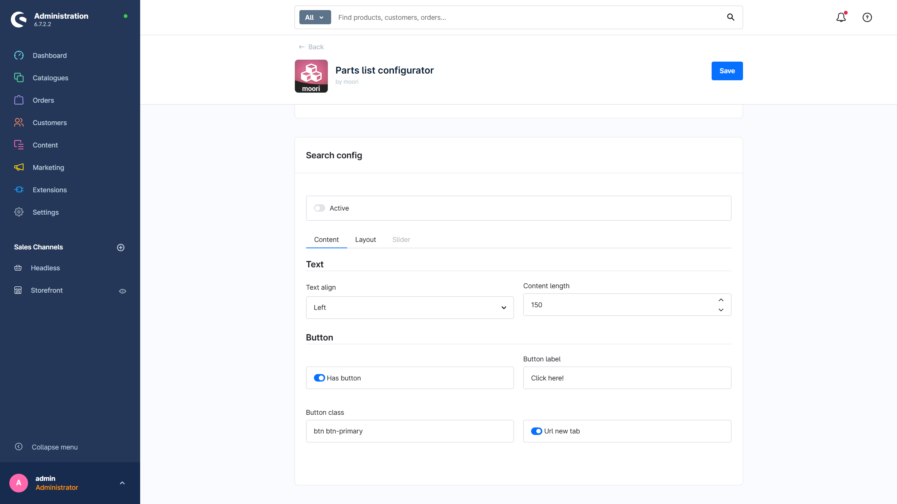
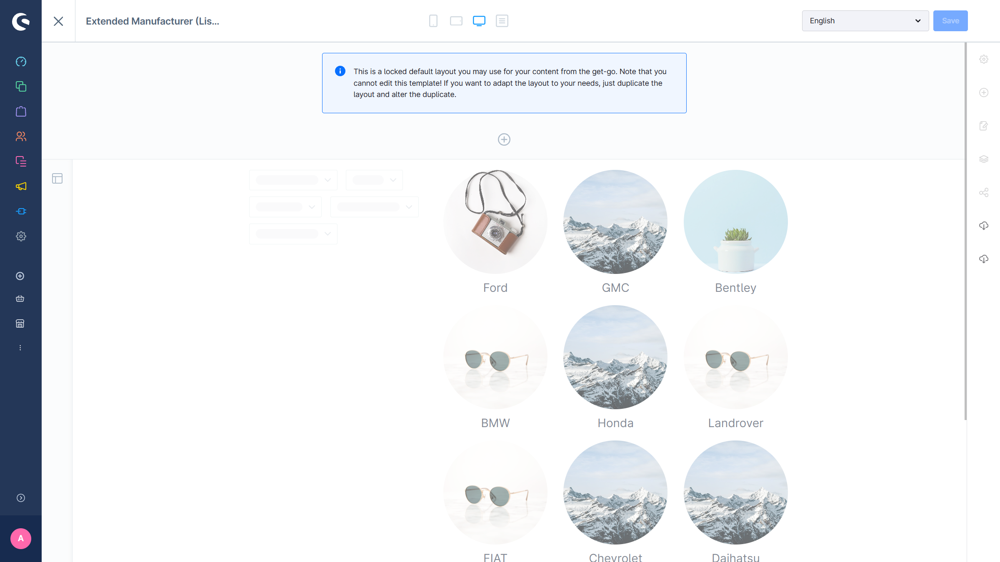
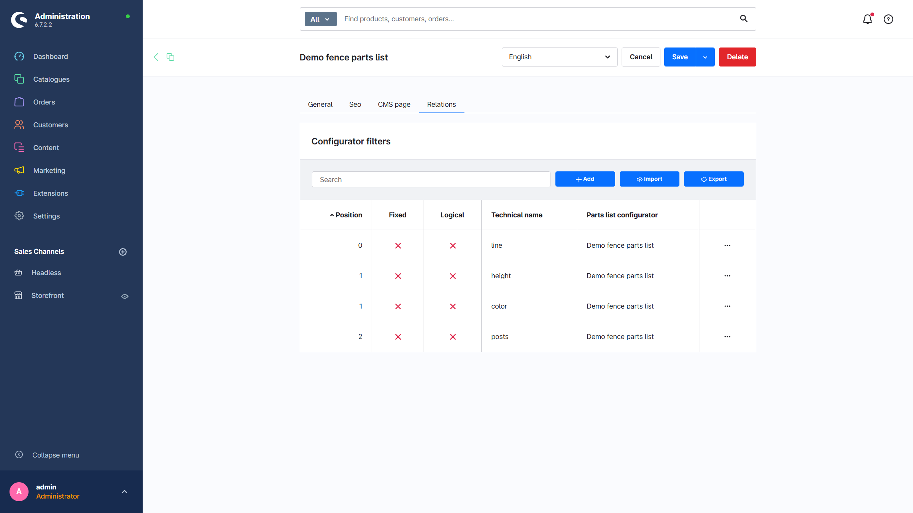

# {var:label_de_de}

{var:description_de_de}

---

{file:snippets/docs_demo_plugin.md}

{file:snippets/docs_buy_plugin.md}

{file:snippets/docs_foundation_note.md}

{file:snippets/docs_quickstart.md}

---

## Ersteinrichtung

### Plugin Konfiguration

1. Hauptseite mit Herstellerübersicht: Die Kategorie auf der alle Hersteller gelistet sind
2. Erweiterte Suche: [Foundation | Erweiterte Suche](../MoorlFoundation/advanced-search.md)

### Allgemeine Übersicht

Über die Hauptnavigation im Admin: `Kataloge` → `Erweiterte Hersteller` gibt es eine Übersicht für alle angelegten Einträge. Hier kann man neue Einträge anlegen, oder bestehende Einträge duplizieren oder löschen.

## Neuen Hersteller hinzufügen

Dieses Plugin basiert auf die Hersteller, die es bereits in Shopware gibt, diese können optional erweitert werden. Um einen erweiterten Hersteller zu erstellen, muss mindestens ein Hersteller in Shopware angelegt sein.

Legen Sie zuerst einen Hersteller in Shopware an: `Kataloge` → `Hersteller` → `Hersteller hinzufügen`.

Anschließend können Sie einen neuen erweiterten Hersteller erstellen: `Kataloge` → `Erweiterte Hersteller` → `hinzufügen`.

### Eingabemaske

Allgemein:

- Produkt Hersteller: Der Hersteller, der durch das Plugin erweitert wird
- Name: Name des Herstellers
- Teaser/Kurzbeschreibung
- Beschreibung im HTML Format
- Schlüsselwörter

Sichtbarkeit:

- Aktiv
- Kategorien: Produktlisten im Storefront, in denen der Hersteller vertreten ist. Man kann durch einen Link von der Herstellerseite direkt in die Kategorie springen und der Hersteller ist bereits im Filter ausgewählt.
- Tags: Erscheinen im CMS-Metabereich der Herstellerseite. Hersteller können auch nach Tags gefiltert werden.

Medien:

- Avatar: Das Herstellerlogo kann durch dieses Bild überschrieben werden
- Banner: Ein Banner für die Herstellerseite im Storefront

Kontakt: Allgemeine Kontaktmöglichkeiten

Adresse: Adresse und Geokoordinaten des Herstellers

SEO: Meta Angaben zum Hersteller

CMS Seite: Zuweisung und Konfiguration der CMS Seite des Herstellers

## CMS Seiten

Mit der Installation des Plugins werden bereits zwei CMS Seiten erstellt. Eine Seite für die Übersicht aller Hersteller und eine für die Herstellerseite. Um die CMS Seiten anzupassen, können die bestehenden Seiten dupliziert und bearbeitet werden.

### Erweiterte Hersteller (Liste)

### Erweiterte Hersteller (Standard)

